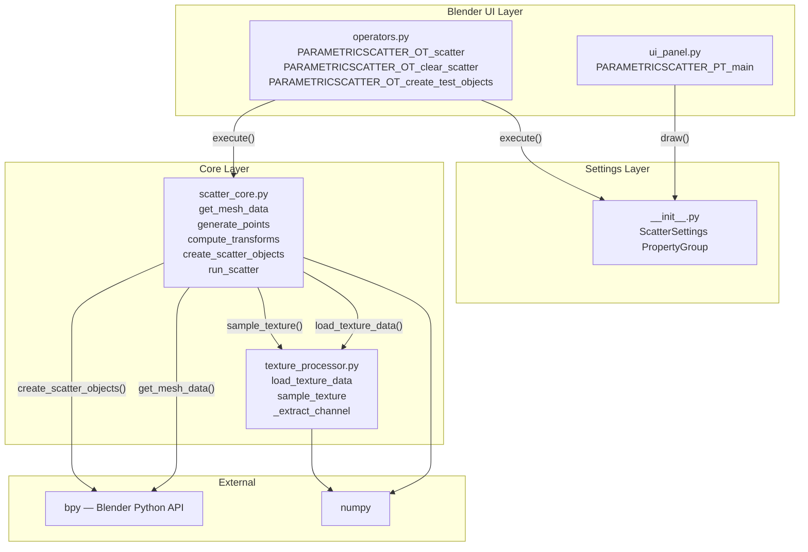
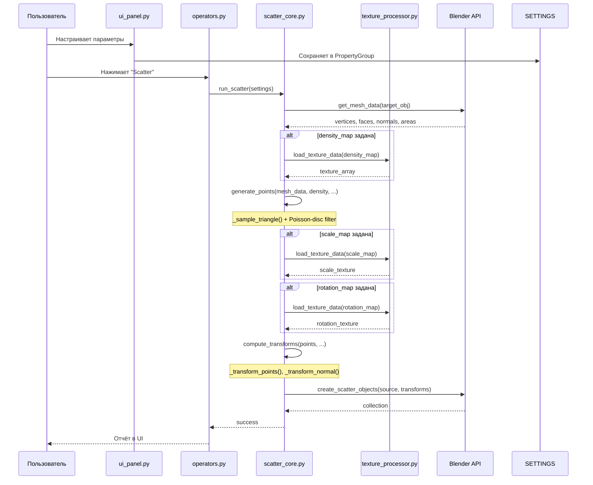
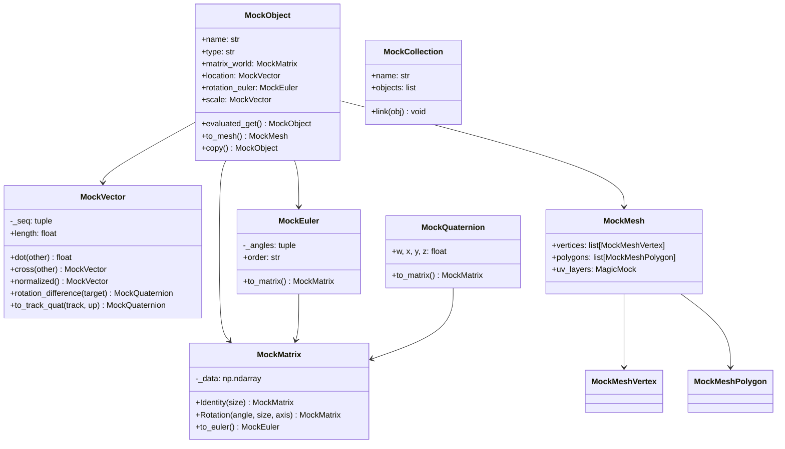
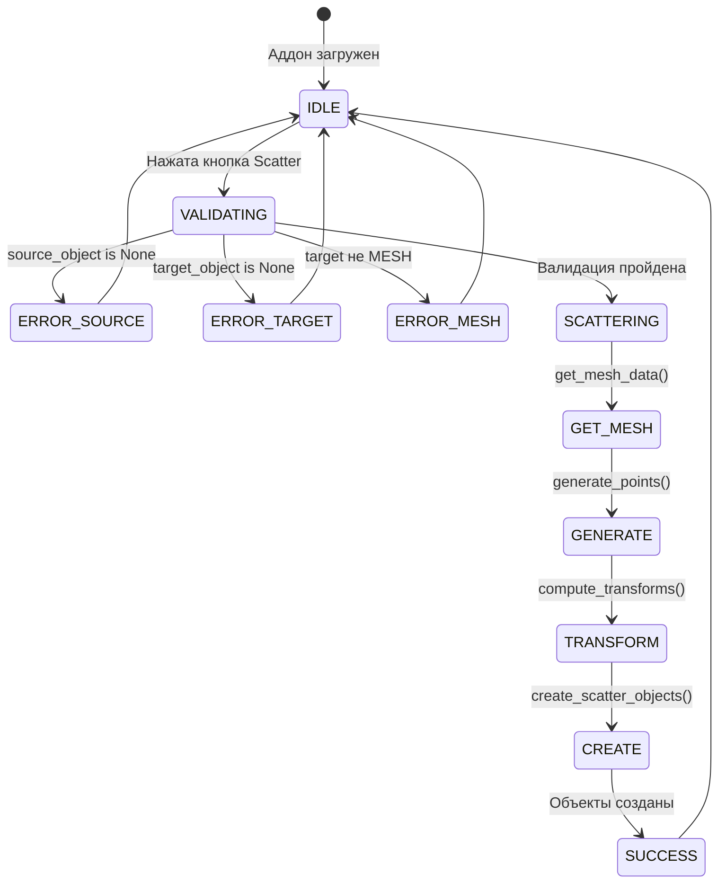

# Архитектура Parametric Scatter

## Общая структура

```
parametric_scatter/
├── __init__.py              # Регистрация аддона, ScatterSettings (PropertyGroup)
├── blender_manifest.toml    # Манифест для Blender 4.2+ Extensions
├── scatter_core.py          # Ядро: геометрия, генерация точек, трансформации
├── texture_processor.py     # Загрузка и сэмплирование текстур
├── operators.py             # Операторы Scatter / Clear / Create Test Objects
├── ui_panel.py              # UI-панель в 3D Viewport
├── README.md                # Документация пользователя
├── docs/
│   ├── architecture.md      # Архитектура и диаграммы (данный файл)
│   └── api.md               # API-документация
├── tests/
│   ├── __init__.py
│   ├── conftest.py          # Фикстуры и моки для тестирования
│   ├── test_texture_processor.py
│   ├── test_scatter_core.py
│   └── test_integration.py
├── .bandit                  # Конфигурация SAST-анализатора bandit
├── requirements-dev.txt     # Зависимости для разработки
└── Makefile                 # Цели: test, lint, security, docs
```

## Диаграмма компонентов



## Диаграмма потока данных (Data Flow)



## Диаграмма классов (моки для тестирования)



## Диаграмма состояний оператора Scatter



## Зависимости модулей

| Модуль | Импортирует | Назначение |
|--------|-------------|------------|
| `__init__.py` | `bpy`, `scatter_core`, `texture_processor`, `ui_panel`, `operators` | Регистрация, PropertyGroup |
| `scatter_core.py` | `bpy`, `mathutils`, `numpy`, `texture_processor` | Ядро алгоритма |
| `texture_processor.py` | `bpy`, `numpy` | Обработка текстур |
| `operators.py` | `bpy`, `scatter_core` | Операторы |
| `ui_panel.py` | `bpy` | UI-панель |
